# BodyBuilder

> AI-Driven Personalized  Fitness Consultant
## Demo video

[Link](https://drive.google.com/file/d/1reqXDsdfjA_BO4j-5Ik1LGYH5Yc1iyrT/view?usp=sharing)

## Project Overview

This project is an **AI-driven health and fitness consultant system** designed to provide personalized fitness plans and medical recommendations. The system integrates multiple agents, each responsible for specific aspects of the user's fitness journey, including user profiling, medical prescription integration, fitness plan generation, and workout curation. By leveraging advanced AI models and state management, it delivers customized solutions tailored to individual health and fitness goals.

The project includes a **FastAPI backend** and a **React frontend**, which work together to provide a seamless user experience.

## System Architecture

The system is composed of several interconnected agents, each performing a unique role in the process:

### 1. **Consultant Agent**

- **Role**: Acts as the central orchestrator, analyzing user context and routing tasks to relevant agents. It interacts with the user to gather goals, preferences, and health data.

- **Key Functions**: Load user profile, call other agents (e.g., doctor suggestions, strategy planning), and provide system feedback.

### 2. **Profile Analyzer**

- **Role**: Analyzes the user's body composition (using InBody metrics), health data, and fitness goals. It plays a critical role in personalizing recommendations.

- **Key Functions**: Extract and analyze body composition data, update user profiles with the latest scan.

### 3. **Doctor Agent**

- **Role**: Provides medical suggestions based on user health data, injuries, and fitness goals. This agent ensures that the workout plans are safe and suitable for the user.

- **Key Functions**: Generate medical suggestions, analyze weak body parts, and recommend safety constraints.

### 4. **Strategy Agent**

- **Role**: Plans the user’s weekly fitness schedule, taking into account workout frequency, focus areas, safety constraints, and medical recommendations.

- **Key Functions**: Design personalized weekly fitness strategies with rest days, exercises, and focus areas.

### 5. **Curator Agent**

- **Role**: Curates a list of exercises for each day based on the user’s plan and available equipment. It customizes the workout list, adding sets, reps, and ensuring adherence to safety guidelines.

- **Key Functions**: Generate and curate exercises for each day, respecting user constraints and preferences.

### 6. **Plan Compiler**

- **Role**: Compiles the final weekly workout plan by integrating the exercises curated by the Curator Agent and assembling them into the full schedule.

- **Key Functions**: Re-assemble and finalize the workout plan, ensuring all data is aligned with the user’s fitness goals.

### 7. **Database Syncing**

- **Role**: Syncs all updates (e.g., user profile, medical prescriptions, weekly plan) to the database, ensuring that all information is stored for future use.

- **Key Functions**: Persist changes to the user profile, medical prescriptions, and workout plans into the database.

## Technologies Used

### Backend

- **FastAPI**: The core backend framework, responsible for managing API requests, handling user authentication, and serving data to the frontend.
- **SQLAlchemy & PostgreSQL**: Used for database management, storing user profiles, workout plans, and medical prescriptions.
- **Ollama, Gemini**: AI models for generating personalized suggestions and workout strategies.
- **Pydantic**: For data validation and defining structured schemas.
- **LangChain & LangGraph**: Frameworks for agent communication and workflow management.

### Frontend

- **React**: The frontend framework used for building the interactive user interface.

- **Axios**: For making API requests to the FastAPI backend.

## Features

- **Personalized Health Insights**: Analyzes body metrics and provides detailed health analysis.
- **Medical Recommendations**: Generates doctor-approved workout suggestions based on health conditions and injuries.
- **Weekly Strategy**: Plans a weekly fitness schedule, balancing workout days with rest days and focusing on targeted muscle groups.
- **Exercise Curation**: Generates a curated list of exercises for each workout session, tailored to the user’s equipment and fitness level.
- **Real-Time Syncing**: Syncs user data with the database, ensuring the system is always up to date with the latest information.
- **User Authentication**: Secure user login and authentication using JWT tokens to ensure personalized experiences.


## Getting Started

## Prerequisites

- Python 3.11 (Managed by pyenv)
- Node.js & npm
- Docker & Docker Compose
- python venv module (Virtual Environment)

## How to Run

> [!IMPORTANT]
> The commands below are optimized for MacOS/Linux. Windows users should use backslashes (`\`) for paths and `pyenv-win` for version management.

### 1. Database Setup

Ensure you have the correct Python version and start the PostgreSQL instance using Docker.

```bash
# Set local python version
pyenv install 3.11
pyenv local 3.11

# Start the PostgreSQL database
docker compose up -d db
```

### 2. Backend Setup

Navigate to the project root and initialize your Python environment.

#### Create Virtual Environment

**MacOS/Linux:**

```bash
python -m venv venv
source ./venv/bin/activate
```

**Windows:**

```bash
python -m venv venv
.\venv\Scripts\activate
```

#### Install Dependencies

```bash
pip install -r requirements.txt
pip install pre-commit
pre-commit install --install-hooks
```

#### Configure Environment Variables

Create a `.env` file in the root directory:

```bash
cp example.env .env
```

Update your `.env` with the following Database and API Key details:

```ini
POSTGRES_HOST=localhost
POSTGRES_PORT=5434
POSTGRES_USER=user
POSTGRES_PASSWORD=pass
POSTGRES_DB=bodybuilder_db
GOOGLE_API_KEY=your-google-api-key
RAPIDAPI_KEY=your-rapidapi-key
JWT_SECRET_KEY=your_jwt_secret_key_here
```

> **Note:** Get your `RAPIDAPI_KEY` by signing up for the free plan at [ExerciseDB API](https://rapidapi.com/ascendapi/api/exercisedb-api1) .

#### Run Database Migrations

Initialize the Schema via Alembic :

```bash
cd backend
alembic upgrade head
```

#### Start Backend Server

```bash
# Standard FastAPI execution
uvicorn app.main:app --reload --port 8000

# OR using LangGraph development tools
langgraph dev
```

### 3. Frontend Setup

Navigate to the frontend directory to set up the Vite React environment.

#### Configure Frontend Environment

Create a `.env` file in the `frontend` folder:

```bash
# frontend/.env
VITE_API_URL=http://localhost:8000/api
```

#### Install and Run

```bash
cd frontend
npm install
npm run dev
```

## Development Workflow

### Installing New Packages

If you install new Python packages, ensure they are tracked:

```bash
# Activate venv first
pip install <package-name>
pip freeze > requirements.txt
```

### Pre-commit Hooks

This project uses `pre-commit` to ensure code quality. It will automatically run Linting and Formatting checks before every commit.

## Graph Preview

```mermaid
---
config:
  flowchart:
    curve: linear
---
graph TD;
        __start__([<p>__start__</p>]):::first
        load_user_context(load_user_context)
        consultant(consultant)
        run_tasks(run_tasks)
        sync_db(sync_db)
        conclusion(conclusion)
        announce_curator(announce_curator)
        announce_strategy(announce_strategy)
        __end__([<p>__end__</p>]):::last
        __start__ --> load_user_context;
        announce_curator --> curator_agent\3acurator_worker\3a__start__;
        announce_strategy --> strategy_agent\3astrategy_scheduler;
        consultant -. &nbsp;__end__&nbsp; .-> conclusion;
        consultant -.-> run_tasks;
        curator_agent\3aplan_compiler --> sync_db;
        doctor_agent\3aconclude_suggestion -. &nbsp;curator&nbsp; .-> announce_curator;
        doctor_agent\3aconclude_suggestion -. &nbsp;strategy&nbsp; .-> announce_strategy;
        doctor_agent\3aconclude_suggestion -.-> sync_db;
        load_user_context --> consultant;
        profile_agent\3ainbody_analysis -. &nbsp;doctor&nbsp; .-> doctor_agent\3aannounce_doctor;
        profile_agent\3ainbody_analysis -.-> sync_db;
        run_tasks -. &nbsp;__end__&nbsp; .-> conclusion;
        run_tasks -. &nbsp;doctor&nbsp; .-> doctor_agent\3aannounce_doctor;
        run_tasks -. &nbsp;update_inbody&nbsp; .-> profile_agent\3ainbody_analysis;
        run_tasks -.-> sync_db;
        strategy_agent\3aplan_reconstruct --> announce_curator;
        sync_db --> conclusion;
        conclusion --> __end__;
        subgraph doctor_agent
        doctor_agent\3aannounce_doctor(announce_doctor)
        doctor_agent\3aconclude_suggestion(conclude_suggestion)
        doctor_agent\3aannounce_doctor --> doctor_agent\3aconclude_suggestion;
        end
        subgraph strategy_agent
        strategy_agent\3astrategy_scheduler(strategy_scheduler)
        strategy_agent\3aplan_reconstruct(plan_reconstruct)
        strategy_agent\3astrategy_scheduler --> strategy_agent\3aplan_reconstruct;
        end
        subgraph curator_agent
        curator_agent\3aplan_compiler(plan_compiler)
        curator_agent\3acurator_worker\3aformalizer --> curator_agent\3aplan_compiler;
        subgraph curator_worker
        curator_agent\3acurator_worker\3a__start__(<p>__start__</p>)
        curator_agent\3acurator_worker\3aagent(agent)
        curator_agent\3acurator_worker\3atools(tools)
        curator_agent\3acurator_worker\3aformalizer(formalizer)
        curator_agent\3acurator_worker\3a__start__ --> curator_agent\3acurator_worker\3aagent;
        curator_agent\3acurator_worker\3aagent -. &nbsp;__end__&nbsp; .-> curator_agent\3acurator_worker\3aformalizer;
        curator_agent\3acurator_worker\3aagent -.-> curator_agent\3acurator_worker\3atools;
        curator_agent\3acurator_worker\3atools --> curator_agent\3acurator_worker\3aagent;
        end
        end
        subgraph profile_agent
        profile_agent\3ainbody_analysis(inbody_analysis)
        end
        classDef default fill:#f2f0ff,line-height:1.2
        classDef first fill-opacity:0
        classDef last fill:#bfb6fc
```




