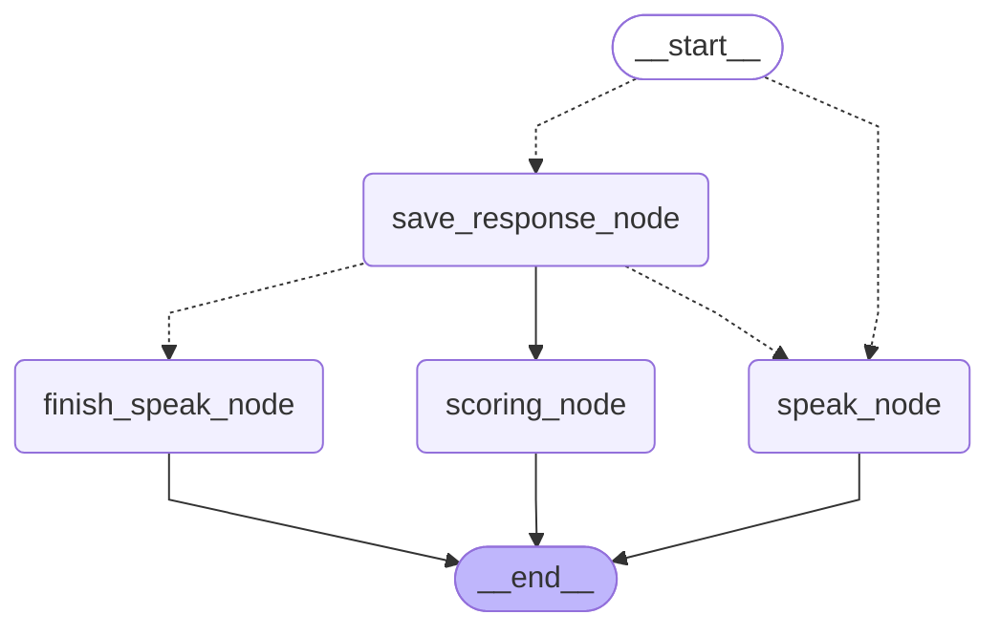
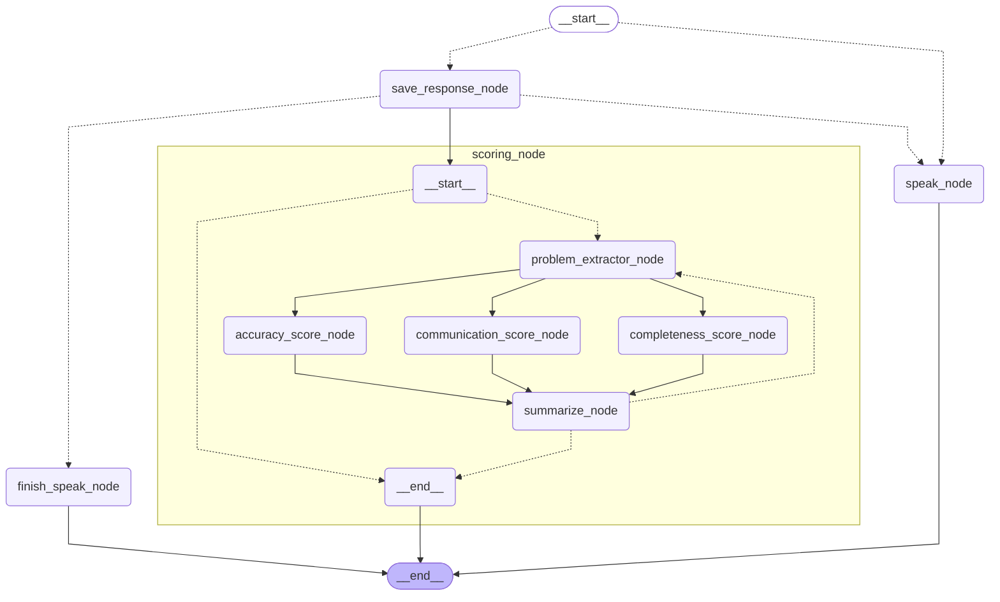

# interviewer agent

```mermaid
---
config:
  flowchart:
    curve: linear
---
graph TD;
        __start__([<p>__start__</p>]):::first
        speak_node(speak_node)
        save_response_node(save_response_node)
        finish_speak_node(finish_speak_node)
        scoring_node(scoring_node)
        __end__([<p>__end__</p>]):::last
        __start__ -.-> save_response_node;
        __start__ -.-> speak_node;
        save_response_node -.-> finish_speak_node;
        save_response_node --> scoring_node;
        save_response_node -.-> speak_node;
        finish_speak_node --> __end__;
        scoring_node --> __end__;
        speak_node --> __end__;
        classDef default fill:#f2f0ff,line-height:1.2
        classDef first fill-opacity:0
        classDef last fill:#bfb6fc

```

## expended structure

```mermaid
---
config:
  flowchart:
    curve: linear
---
graph TD;
        __start__([<p>__start__</p>]):::first
        speak_node(speak_node)
        save_response_node(save_response_node)
        finish_speak_node(finish_speak_node)
        __end__([<p>__end__</p>]):::last
        __start__ -.-> save_response_node;
        __start__ -.-> speak_node;
        save_response_node -.-> finish_speak_node;
        save_response_node --> scoring_node\3a__start__;
        save_response_node -.-> speak_node;
        finish_speak_node --> __end__;
        scoring_node\3a__end__ --> __end__;
        speak_node --> __end__;
        subgraph scoring_node
        scoring_node\3a__start__(<p>__start__</p>)
        scoring_node\3aproblem_extractor_node(problem_extractor_node)
        scoring_node\3aaccuracy_score_node(accuracy_score_node)
        scoring_node\3acommunication_score_node(communication_score_node)
        scoring_node\3acompleteness_score_node(completeness_score_node)
        scoring_node\3asummarize_node(summarize_node)
        scoring_node\3a__end__(<p>__end__</p>)
        scoring_node\3a__start__ -.-> scoring_node\3a__end__;
        scoring_node\3a__start__ -.-> scoring_node\3aproblem_extractor_node;
        scoring_node\3aaccuracy_score_node --> scoring_node\3asummarize_node;
        scoring_node\3acommunication_score_node --> scoring_node\3asummarize_node;
        scoring_node\3acompleteness_score_node --> scoring_node\3asummarize_node;
        scoring_node\3aproblem_extractor_node --> scoring_node\3aaccuracy_score_node;
        scoring_node\3aproblem_extractor_node --> scoring_node\3acommunication_score_node;
        scoring_node\3aproblem_extractor_node --> scoring_node\3acompleteness_score_node;
        scoring_node\3asummarize_node -.-> scoring_node\3a__end__;
        scoring_node\3asummarize_node -.-> scoring_node\3aproblem_extractor_node;
        end
        classDef default fill:#f2f0ff,line-height:1.2
        classDef first fill-opacity:0
        classDef last fill:#bfb6fc
```