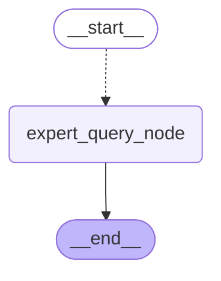

# knowledge agent

```mermaid
---
config:
  flowchart:
    curve: linear
---
graph TD;
        __start__([<p>__start__</p>]):::first
        expert_query_node(expert_query_node)
        __end__([<p>__end__</p>]):::last
        __start__ -.-> expert_query_node;
        expert_query_node --> __end__;
        classDef default fill:#f2f0ff,line-height:1.2
        classDef first fill-opacity:0
        classDef last fill:#bfb6fc

```
