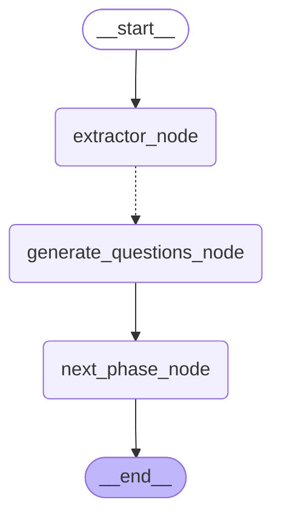

# onboarding_agent.md

```mermaid
---
config:
  flowchart:
    curve: linear
---
graph TD;
        __start__([<p>__start__</p>]):::first
        extractor_node(extractor_node)
        generate_questions_node(generate_questions_node)
        next_phase_node(next_phase_node)
        __end__([<p>__end__</p>]):::last
        __start__ --> extractor_node;
        extractor_node -.-> generate_questions_node;
        generate_questions_node --> next_phase_node;
        next_phase_node --> __end__;
        classDef default fill:#f2f0ff,line-height:1.2
        classDef first fill-opacity:0
        classDef last fill:#bfb6fc

```

## workflow

- extractor user profile and job description
- generate_base question base on the user skill