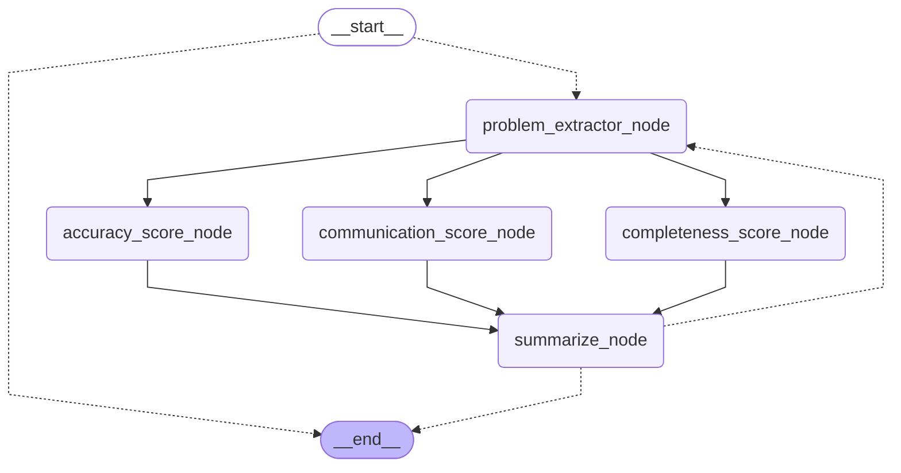

# scoring agent

```mermaid
---
config:
  flowchart:
    curve: linear
---
graph TD;
        __start__([<p>__start__</p>]):::first
        problem_extractor_node(problem_extractor_node)
        accuracy_score_node(accuracy_score_node)
        communication_score_node(communication_score_node)
        completeness_score_node(completeness_score_node)
        summarize_node(summarize_node)
        __end__([<p>__end__</p>]):::last
        __start__ -.-> __end__;
        __start__ -.-> problem_extractor_node;
        accuracy_score_node --> summarize_node;
        communication_score_node --> summarize_node;
        completeness_score_node --> summarize_node;
        problem_extractor_node --> accuracy_score_node;
        problem_extractor_node --> communication_score_node;
        problem_extractor_node --> completeness_score_node;
        summarize_node -.-> __end__;
        summarize_node -.-> problem_extractor_node;
        classDef default fill:#f2f0ff,line-height:1.2
        classDef first fill-opacity:0
        classDef last fill:#bfb6fc


```
