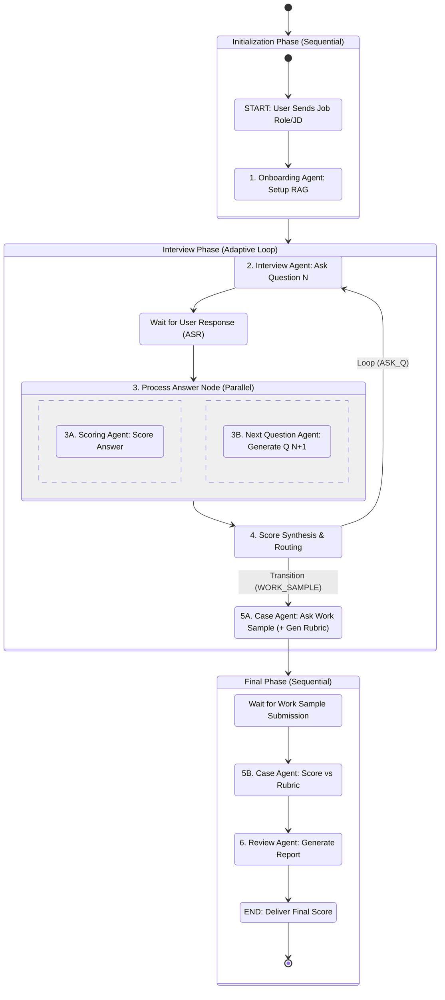

# Interviewer App: Multi-Agent Workflow Blueprint

This document outlines the three-phase, parallel workflow for the **Interviewer** app, optimized for **adaptive questioning** and **low latency**, which is critical for the ElevenLabs voice integration.

---

## I. Workflow Visualization (LangGraph / State Diagram)

The core optimization is the **parallel execution** step inside the loop, where the **next question is prepared while the current answer is scored**.



**Key idea:**  
Inside the **Interview Phase**, the **Scoring Agent** and **Next Question Agent** run in parallel:

- The **Scoring Agent** evaluates the current answer.
- The **Next Question Agent** pre-computes the next adaptive question.
- A routing node then decides:
  - continue asking questions (`ASK_Q`),
  - move to the work sample (`WORK_SAMPLE`),
  - or end the interview (`END_INTERVIEW`).

---

## II. Agent Roles and Responsibilities

The system is broken down into specialized nodes, coordinating via a single shared `InterviewState`.

### Node Overview

| Node (ID)                  | Agent Name          | Core Responsibility                                       | Key Logic                                                                                       | Latency Strategy                     |
|----------------------------|---------------------|-----------------------------------------------------------|--------------------------------------------------------------------------------------------------|--------------------------------------|
| `onboarding_node`          | Onboarding Agent    | Initialize interview context & RAG                        | Capture JD/Role, embed/setup RAG, prepare initial question buffer                               | Low latency, runs once at start      |
| `interviewer_node`         | Interview Agent     | Handle conversational turns + voice output                | Pull pre-generated question, call ElevenLabs TTS, update conversation history                   | Low latency, uses pre-generated Q    |
| `scoring_node` (3A)        | Scoring Agent       | Score current user answer                                 | Critique answer, update `scorecard`, summarize performance                                      | Parallel execution                   |
| `prepare_next_q_node` (3B) | Next Question Agent | Pre-compute next adaptive question                        | Read scoring summary + history, generate tailored question N+1, save to `next_question_buffer`  | Parallel execution                   |
| `case_node`                | Case Agent          | Introduce & evaluate work sample                          | 5A: generate scenario + hidden rubric; 5B: score answer vs rubric and update `scorecard`        | Sequential, high-value step          |
| `review_node`              | Review Agent        | Final synthesis & report generation                       | Aggregate entire `scorecard` (incl. work sample) and generate final review + learning paths     | Sequential, terminal step            |

### 1. Onboarding Agent (`onboarding_node`)

- **Inputs:**
  - Job role / Job description (JD)
  - User preferences (language, level, etc.)
- **Responsibilities:**
  - Parse JD and extract key competencies.
  - Initialize RAG (embed JD, internal templates, example answers).
  - Seed an initial **question buffer** with 1–2 starter questions.
- **Output to `InterviewState`:**
  - `jd_context`
  - `rag_config` / retriever
  - `next_question_buffer` (initial question)
  - `conversation_history` (intro system messages)

---

### 2. Interview Agent (`interviewer_node`)

- **Inputs:**
  - `next_question_buffer`
  - `conversation_history`
- **Responsibilities:**
  - Fetch **next question** from `next_question_buffer`.
  - Render to voice via ElevenLabs TTS.
  - Append interviewer turn to `conversation_history`.
- **Output:**
  - Updated `conversation_history`
  - Mark that question N has been asked (for scoring alignment).

---

### 3. Process Answer Node (Parallel)

This is the **core optimization**: after user answers (via ASR), two agents run **in parallel**.

#### 3A. Scoring Agent (`scoring_node`)

- **Inputs:**
  - Latest question & user answer
  - `jd_context` + RAG snippets
  - Existing `scorecard`
- **Responsibilities:**
  - Score answer along dimensions (e.g. structure, relevance, depth, communication).
  - Produce short, structured feedback.
  - Decide the next high-level `next_action` (e.g. continue questions, move to work sample, end).
- **Output to `InterviewState`:**
  - Updated `scorecard`
  - `last_answer_feedback`
  - Provisional `next_action` (e.g. `ASK_Q` / `WORK_SAMPLE` / `END_INTERVIEW`).

#### 3B. Next Question Agent (`prepare_next_q_node`)

- **Inputs:**
  - `conversation_history`
  - Summaries from `scorecard` / `last_answer_feedback`
  - `jd_context` & RAG snippets
- **Responsibilities:**
  - Generate adaptive question N+1:
    - Harder/easier depending on performance.
    - Target unsatisfied competencies.
  - Write it into `next_question_buffer`.
- **Output to `InterviewState`:**
  - `next_question_buffer` (updated with question N+1)
  - Optional `question_metadata` (topic tags, difficulty, competency).

> **Note:** Although 3B may conceptually use scoring output, both agents are still treated as **parallel nodes** in LangGraph. You can use the shared state to pass scoring summaries from the previous turn.

---

### 4. Score Synthesis & Routing (`Routing` node)

This node combines the parallel outputs and decides **where the graph goes next**.

- **Inputs:**
  - `next_action` (from Scoring Agent)
  - `scorecard`
  - Remaining question count / interview constraints
- **Responsibilities:**
  - Refine/confirm `next_action`:
    - `ASK_Q`: Continue interview loop.
    - `WORK_SAMPLE`: Move to case/work sample.
    - `END_INTERVIEW`: Terminate and go to review.
- **Routing:**
  - `ASK_Q` → `interviewer_node` (next question is already in `next_question_buffer`).
  - `WORK_SAMPLE` → `case_node` (work sample introduction).
  - `END_INTERVIEW` → `review_node` (final summary).

---

### 5. Case Agent (`case_node`)

The Case Agent has two sub-steps: **Ask Work Sample** and **Score Work Sample**.

#### 5A. Ask Work Sample (+ Generate Rubric)

- **Inputs:**
  - `jd_context`, `scorecard`, `conversation_history`
- **Responsibilities:**
  - Generate a realistic **work sample task**:
    - e.g. “Design an API for X…”, “Debug this log snippet…”
  - Generate a **hidden rubric** (not exposed to user) with criteria and scoring weights.
  - Save rubric in state for later scoring.
- **Output to `InterviewState`:**
  - `work_sample_prompt`
  - `work_sample_rubric`
  - Updated `conversation_history`.

The user then submits a **work sample response** (text or code snippet).

#### 5B. Score vs Rubric

- **Inputs:**
  - `work_sample_prompt`
  - `work_sample_rubric`
  - User’s work sample submission
  - Existing `scorecard`
- **Responsibilities:**
  - Score the work sample strictly against the **hidden rubric**.
  - Update `scorecard` with a dedicated work sample section.
- **Output to `InterviewState`:**
  - Updated `scorecard` (work sample scores).
  - `work_sample_feedback`.

---

### 6. Review Agent (`review_node`)

- **Inputs:**
  - Final `scorecard` (behavioral + work sample)
  - `conversation_history`
  - `jd_context`
- **Responsibilities:**
  - Generate:
    - Final numeric / banded score.
    - Summary of strengths and weaknesses.
    - Competency-level ratings (e.g. “Communication: 4/5”).
    - Suggested next steps / learning path.
- **Output:**
  - `final_report` (structured, ready for front-end rendering).

---

## III. Shared State Keys and Routing Logic

All nodes share and update a single `InterviewState` object.

### Shared State Keys

| State Key             | Purpose                                             | Updated By                                |
|-----------------------|-----------------------------------------------------|-------------------------------------------|
| `jd_context`          | Parsed job description and role context             | Onboarding Agent                          |
| `rag_config`          | RAG configuration / retriever                       | Onboarding Agent                          |
| `conversation_history`| Full conversation turns (user + interviewer)        | Interviewer, Scoring, Case, Review Agents |
| `scorecard`           | Running list of scores & feedback                   | Scoring Agent, Case Agent                 |
| `last_answer_feedback`| Feedback for most recent answer                     | Scoring Agent                             |
| `next_question_buffer`| Pre-computed next adaptive question                 | Onboarding Agent, Next Question Agent     |
| `question_metadata`   | Topic, difficulty, competency tags                  | Next Question Agent                       |
| `next_action`         | Routing flag for next node                          | Scoring Agent (refined in Routing node)   |
| `work_sample_prompt`  | Text of the final work sample task                  | Case Agent (5A)                           |
| `work_sample_rubric`  | Hidden criteria for work sample scoring             | Case Agent (5A)                           |
| `work_sample_feedback`| Feedback specific to the work sample                | Case Agent (5B)                           |
| `final_report`        | Final synthesized feedback & scores                 | Review Agent                              |

### Conditional Routing (`next_action`)

The **Score Synthesis & Routing** step decides the flow based on `next_action` and the state of the interview.

| `next_action` value | Destination Node      | Rationale                                                                 |
|---------------------|-----------------------|---------------------------------------------------------------------------|
| `ASK_Q`             | `interviewer_node`    | Continue main Q/A loop; `next_question_buffer` is ready.                 |
| `WORK_SAMPLE`       | `case_node`           | Candidate is performing well and deep-dive Qs are done → move to case.   |
| `END_INTERVIEW`     | `review_node`         | Time/question limits reached or candidate failed foundationally.         |

---

## IV. Project Directory Structure

A modular, monorepo-style structure to separate the **React frontend** from the **Python/LangGraph backend**.

```text
Interviewer-App/
├── backend/                         # Python/FastAPI/LangGraph Logic
│   ├── app/                         # Main FastAPI application code
│   │   ├── api/                     # API routers (endpoints)
│   │   │   ├── __init__.py
│   │   │   └── interview_router.py  # Endpoints: /start, /chat, /report
│   │   ├── core/                    # LangGraph "Brain"
│   │   │   ├── __init__.py
│   │   │   ├── agent.py             # Graph orchestration (the "sewing" logic)
│   │   │   ├── state.py             # Shared InterviewState definition
│   │   │   └── agents/              # Modular Agent Logic
│   │   │       ├── __init__.py
│   │   │       ├── onboarding/
│   │   │       │   ├── node.py
│   │   │       │   └── tools.py     # RAG ingestion tools
│   │   │       ├── interviewer/
│   │   │       │   ├── node.py
│   │   │       │   └── tools.py     # ElevenLabs TTS tool
│   │   │       ├── scoring/
│   │   │       │   └── node.py      # Logic for scoring & next_action
│   │   │       ├── preparation/
│   │   │       │   └── node.py      # Next Question Generator (parallel)
│   │   │       ├── case/
│   │   │       │   └── node.py      # Case Agent: work sample + rubric + scoring
│   │   │       └── review/
│   │   │           └── node.py      # Report generation
│   │   ├── rag/                     # RAG Components
│   │   │   ├── __init__.py
│   │   │   └── vector_store.py      # Vertex AI / local vector DB setup
│   │   └── main.py                  # App entry point
│   ├── .env                         # API keys (Gemini, ElevenLabs, Google Cloud)
│   ├── requirements.txt
│   └── Dockerfile
└── frontend/                        # React Application
    ├── src/
    │   ├── components/              # UI components (VoiceRecorder, ChatBubble)
    │   ├── pages/                   # Views (Onboarding, Session, Report)
    │   ├── services/                # API client (axios/fetch)
    │   └── App.js
    └── package.json
```

---

## V. Suggested Implementation Order

1. **Backend skeleton**
   - Create `InterviewState`, `agent.py` with a minimal LangGraph.
   - Implement `onboarding_node` + `interviewer_node` with text-only flow.

2. **Scoring + Next Question (parallel)**
   - Add `scoring_node` and `prepare_next_q_node`.
   - Implement routing based on `next_action`.

3. **Case + Review**
   - Implement `case_node` and `review_node`.
   - Return structured `final_report` to frontend.

4. **Frontend**
   - Build simple chat UI.
   - Integrate voice (record + play ElevenLabs audio).
   - Add final report view.
